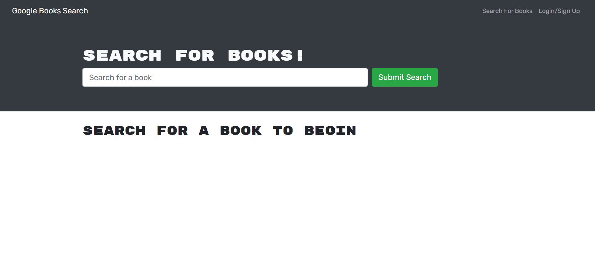

# Book-Search-Engine

## Description

- With Google Book Search, user can search book and save/remove it for later use.
- First when user visits the page, he/she can search a book which will then return a list of books available in google.
- Then user will be given option to save the book or if book is already saved the button text will change to 'Book already saved'
- Then when user saves the books they can visit 'See your Books' tab to get the list of saved books.
- From here user can delete the book from the list.
- Apollo Server is implemented that uses GraphQL queries and mutations to fetch and modify data, replacing the existing RESTful API.
- Apollo Server is applied it to the Express.js server as middleware.
- Authentication tackled by the context of a GraphQL API.
- Apollo Provider implemented to communicate with the Apollo Server.

## Technologies Used

- MongoDB
- Express.js
- React.js
- Node.js

## Installation

To clone the repository run `git clone https://github.com/mikecota09/Book-Search-Engine` in your terminal. After cloning the repo, run `npm install` to install the necessary dependencies.

## Usage

After installing all the dependencies, run `npm start` in your terminal to start the application.

## Deployment

Link to the deployed site https://mikecota09.github.io/Book-Search-Engine/

## Screenshots

## Questions

If you have any questions about the repo, open an issue or contact [Mike Cota](https://github.com/mikecota09) directly at mikecotahf@gmail.com
